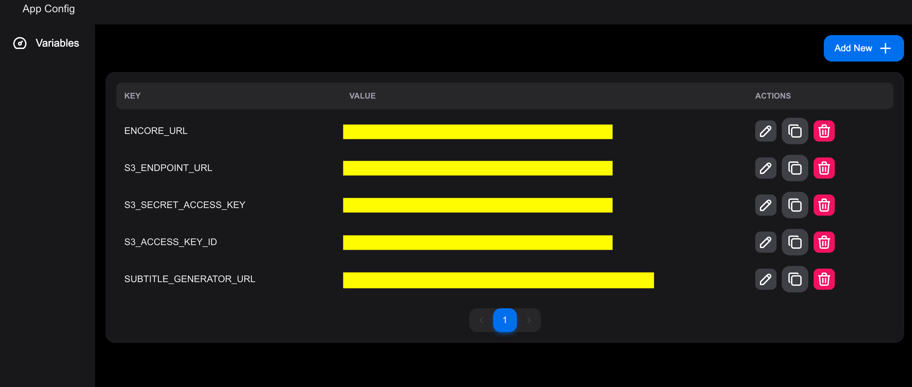

[](https://slack.osaas.io)

# Eyevinn Open Media Supply Orchestrator

> _Part of Eyevinn Open Media Supply Chain Solution_


A solution for content preparation for Video On Demand (VOD) streaming fully based on open web services in [Eyevinn Open Source Cloud](https://www.osaas.io). An open web service is based on open source giving you the option to host this entire solution in your own premises or cloud infrastructure. This solution features:

- Automatic generation of subtitles.
- Transcoding and creating VOD package for streaming in HLS and MPEG-DASH.
- Automated process triggered when a file is uploaded to a bucket and result stored in another bucket.

This repository contains the media supply chain orchestrator that will drive this process.

## Requirements

- An [Eyevinn Open Source Cloud account](https://app.osaas.io) on Professional plan.
- [NodeJS 20+ installed](https://nodejs.org/en/download).
- [Minio CLI installed](https://min.io/docs/minio/linux/reference/minio-mc.html).
- An OpenAI account and [OpenAI API access](https://platform.openai.com/docs/overview) (for automatic subtitling).

## Installation / Usage

We will setup and use the following open web services. Make sure you have activated these services or have remaining services available on your subscription plan:

- [MinIO Server](https://docs.osaas.io/osaas.wiki/Service%3A-MinIO.html)
- [SVT Encore](https://docs.osaas.io/osaas.wiki/Service%3A-SVT-Encore.html)
- [Subtitle Generator](https://docs.osaas.io/osaas.wiki/Service%3A-Subtitle-Generator.html)
- [Shaka Packager](https://docs.osaas.io/osaas.wiki/Service%3A-Shaka-Packager.html)

For creation of the instances we will use the Open Source Cloud CLI in this example. If you don't want to use the CLI you can use the Open Source Cloud web console instead.

For deployment of this orchestrator in Open Source Cloud we need additional three services:

- [Web Runner](https://docs.osaas.io/osaas.wiki/Service%3A-Web-Runner.html)
- Applicaton Config Service
- [Valkey](https://docs.osaas.io/osaas.wiki/Service%3A-Valkey.html) key value store

### Store OSC Access Token in your environment

Obtain your OSC Access Token (your personal access token) from the web console in Settings/API page. Copy this value to the clipboard and save it in an environment variable called `OSC_ACCESS_TOKEN`.

```bash
% export OSC_ACCESS_TOKEN=<personal-access-token>
```

### Create MinIO server

Navigate to the [MinIO service](https://app.osaas.io/dashboard/service/minio-minio) in Open Source Cloud web console and create a service secret called `rootpassword` storing the password for the MinIO root user. It needs to be a mix of lowercase and uppercase and contain a number.

Create a MinIO server for the storage buckets we will use.

```bash
% npx -y @osaas/cli create minio-minio mediasupply \
  -o RootUser=root \
  -o RootPassword="{{secrets.rootpassword}}"
Instance created:
{
  name: 'mediasupply',
  url: '<minio-server-url>',
  ...
}
```

The URL to the MinIO server (`<minio-server-url>`) is the S3 Endpoint that will be referred to later in this guide. Create an alias for convience using the MinIO client.

```bash
%  mc alias set mediasupply <minio-server-url> root <minio-root-password>
```

Now we can create three buckets we will need.

```bash
% mc mb mediasupply/input
% mc mb mediasupply/abrsubs
% mc mb mediasupply/origin
```

### Create Subtitle Generator

Navigate to the [Subtitle Generator service](https://app.osaas.io/dashboard/service/eyevinn-auto-subtitles) in Open Source Cloud web console and create the following secrets:

- `openaikey` - Your OpenAI API key
- `miniopwd` - `<minio-root-password>`

Create a Subtitle Generator instance using the Open Source Cloud CLI (or the web console).

```bash
% npx -y @osaas/cli create eyevinn-auto-subtitles mediasupply \
  -o openaikey="{{secrets.openaikey}}" \
  -o awsAccessKeyId=root \
  -o awsSecretAccessKey="{{secrets.miniopwd}}" \
  -o s3Endpoint="<minio-server-url>"
Instance created:
{
  name: 'mediasupply',
  url: '<subtitle-generator-url>',
  ...
}
```

### Create SVT Encore transcoder queue

Navigate to the [SVT Encore service](https://app.osaas.io/dashboard/service/encore) in Open Source web console and create the following secret:

- `miniopwd` - `<minio-root-password>`

Create an SVT Encore transcoding queue.

```bash
% npx -y @osaas/cli create encore mediasupply \
  -o s3AccessKeyId=root \
  -o s3SecretAccessKey="{{secrets.miniopwd}}" \
  -o s3Endpoint="<minio-server-url>"
Instance created:
{
  name: 'mediasupply',
  url: '<svtencore-url>',
  ...
}
```

### Configure Shaka Packager

Navigate to the [Shaka Packager service](https://app.osaas.io/dashboard/service/eyevinn-shaka-packager-s3) in web console and create the following secret:

- `miniopwd` - `<minio-root-password>`

### Deploy this Media Supply Chain Orchestrator

Now we can deploy this Media Supply Chain orchestrator that will automate this supply chain process.

Create an Application Config Service for storing the orchestrator configuration. Start by creating a Valkey instance to be used by the config service.

```bash
% npx -y @osaas/cli db create valkey mediasupply
redis://<valkey-ip>:<valkey-port>
```

Then create the config service instance

```bash
% npx -y @osaas/cli create eyevinn-app-config-svc mediasupply -o RedisUrl="redis://<valkey-ip>:<valkey-port>"
Instance created:
{
  name: 'mediasupply',
  url: '<app-config-url>',
  ...
}
```

Navigate to the `<app-config-url>` and create the following configuration variables.



```
S3_ACCESS_KEY_ID=root
S3_SECRET_ACCESS_KEY=<minio-root-password>
S3_ENDPOINT_URL=<minio-server-url>
ENCORE_URL=<svtencore-url>
SUBTITLE_GENERATOR_URL=<subtitle-generator-url>
```

To ensure that the orchestrator maintains state during a restart you can provide a URL to a Redis or Valkey store. Create the Valkey for this purpose first.

```bash
% npx -y @osaas/cli db create valkey orchestrator
redis://<orchestrator-valkey-ip>:<orchestrator-valkey-port>
```

```
REDIS_URL=redis://<orchestrator-valkey-ip>:<orchestrator-valkey-port>
```

For deployment of this repository you need to first create a GitHub personal access token. Follow the instructions in this [guide](https://docs.osaas.io/osaas.wiki/Service%3A-Web-Runner.html) to create it.

Navigate to the [Web Runner service](https://app.osaas.io/dashboard/service/eyevinn-web-runner) in Open Source Cloud web console and create a service secret `ghtoken` to store the GitHub personal access token and another service secret `osctoken` for your OSC personal access token.

```bash
% npx -y @osaas/cli create eyevinn-web-runner mediasupply \
  -o GitHubUrl=https://github.com/Eyevinn/media-supply-orchestrator \
  -o GitHubToken="{{secrets.ghtoken}}" \
  -o OscAccessToken="{{secrets.osctoken}}" \
  -o ConfigService=mediasupply
Instance created:
{
  name: 'mediasupply',
  url: 'https://eyevinnlab-mediasupply.eyevinn-web-runner.auto.prod.osaas.io',
  ...
}
```

Now the media supply chain orchestrator is running and listening on events on the input bucket.

Download the example file [VINN.mp4](https://testcontent.eyevinn.technology/mp4/VINN.mp4) and upload it to the input bucket to try this out.

```bash
% mc put VINN.mp4 mediasupply/input/
```

## Development

Setup the open web services as described above (except for the orchestrator) and create the following environment variables pointing to the Open Source Cloud resources created.

```bash
% export OSC_ACCESS_TOKEN=<personal-access-token>
% export S3_ACCESS_KEY_ID=root
% export S3_SECRET_ACCESS_KEY=<minio-root-password>
% export S3_ENDPOINT_URL=<minio-server-url>
% export ENCORE_URL=<svtencore-url>
% export SUBTITLE_GENERATOR_URL=<subtitle-generator-url>
```

For local development you need to use a tool like [ngrok](https://dashboard.ngrok.com/get-started/setup/macos) to create a tunnel to your local computer for the callbacks.

Then install NodeJS dependencies.

```bash
% npm install
```

Create a tunnel using ngrok.

```bash
% ngrok http http://localhost:8000
```

Copy the forward URL returned by ngrok and set that as `PUBLIC_BASE_URL` environment variable.

```bash
% export PUBLIC_BASE_URL=<ngrok-url>
```

Then start the orchestrator.

```bash
% npm start
```

## Contributing

See [CONTRIBUTING](CONTRIBUTING.md)

## License

This project is licensed under the MIT License, see [LICENSE](LICENSE).

# Support

Join our [community on Slack](http://slack.osaas.io/) where you can post any questions regarding any of our open source projects. Eyevinn's consulting business can also offer you:

- Further development of this component
- Customization and integration of this component into your platform
- Support and maintenance agreement

Contact [sales@eyevinn.se](mailto:sales@eyevinn.se) if you are interested.

# About Eyevinn Technology

[Eyevinn Technology](https://www.eyevinntechnology.se) help companies in the TV, media, and entertainment sectors optimize costs and boost profitability through enhanced media solutions.
We are independent in a way that we are not commercially tied to any platform or technology vendor. As our way to innovate and push the industry forward, we develop proof-of-concepts and tools. We share things we have learn and code as open-source.

With Eyevinn Open Source Cloud we enable to build solutions and applications based on Open Web Services and avoid being locked in with a single web service vendor. Our open-source solutions offer full flexibility with a revenue share model that supports the creators.

Read our blogs and articles here:

- [Developer blogs](https://dev.to/video)
- [Medium](https://eyevinntechnology.medium.com)
- [OSC](https://www.osaas.io)
- [LinkedIn](https://www.linkedin.com/company/eyevinn/)

Want to know more about Eyevinn, contact us at info@eyevinn.se!
